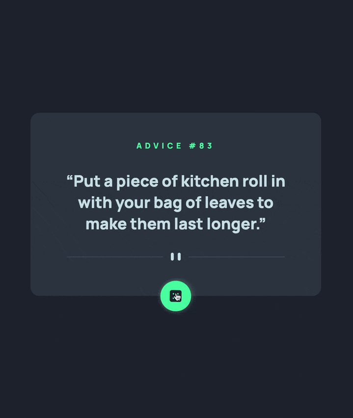

# Advice Generator App

## Table of contents

- [Overview](#overview)
- [Getting started](#getting-started)
- [Screenshot](#screenshot)
- [Links](#links)
- [Built with](#built-with)
- [Author](#author)

## Overview

Users should be able to:

- View the optimal layout for the app depending on their device's screen size
- See hover states for all interactive elements on the page
- Generate a new piece of advice by clicking the dice icon

## Getting Started

```bash
npm run start # start the application in development mode
npm run build # bundle the application using Webpack
```

## Screenshot



## Links

- Solution URL: [Solution URL]()
- Live Site URL: [Live site URL]()

## Built with

- Semantic HTML5 markup
- CSS custom properties
- CSS Grid
- Mobile-first workflow
- [React](https://reactjs.org/) - JS library
- [CSS Module](https://github.com/css-modules/css-modules) - For styles

## 🙋 Author

Seung Woo (Paul) Ji

- [LinkedIn](https://www.linkedin.com/in/seung-woo-paul-ji-8b697a193/)
- [Frontend Mentor](https://www.frontendmentor.io/profile/seungwoo-ji)
